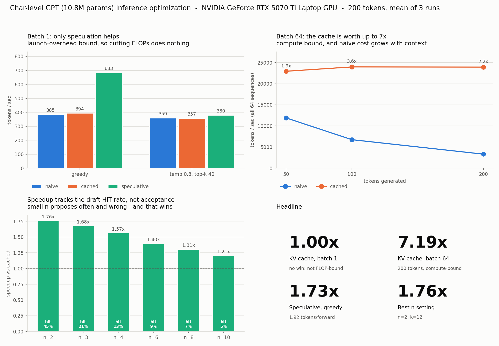

# olivergpt

A character-level GPT implemented from scratch in PyTorch, without `nn.MultiheadAttention`
or `nn.TransformerEncoderLayer`, trained on a corpus of my own Discord messages. I then
added two inference optimizations, KV caching and speculative decoding, and wrote tests
confirming that both produce output identical to the unoptimized version.

<sub>Python 3.10+ · PyTorch 2.7+ · single GPU · 10.8M params · MIT</sub>



## Results

Measured on an RTX 5070 Ti Laptop, 200 tokens, mean of 3 runs after a warmup. Raw data in
[`results/benchmark_results.json`](results/benchmark_results.json).

Batch 1:

| Decoding | Naive | Cached | Speculative | Cache | Spec |
|---|---:|---:|---:|---:|---:|
| Greedy | 385 tok/s | 394 tok/s | 683 tok/s | 1.02x | 1.73x |
| Temp 0.8, top-k 40 | 359 tok/s | 357 tok/s | 380 tok/s | 0.99x | 1.06x |

Batch 64:

| Tokens | Naive | Cached | Speedup |
|---:|---:|---:|---:|
| 50 | 11,901 tok/s | 22,941 tok/s | 1.93x |
| 100 | 6,750 tok/s | 23,966 tok/s | 3.55x |
| 200 | 3,326 tok/s | 23,928 tok/s | 7.19x |

Cached throughput stays flat as generation gets longer while naive throughput roughly halves
each time the length doubles, so the cache speedup is not a fixed number. Quoting it without
a token count doesn't mean much.

### The KV cache does nothing at batch 1

This surprised me, so I profiled it instead of assuming the implementation was broken. A
forward pass costs 2.29 ms at one token and 2.75 ms at 256, which is 256x the arithmetic for
20% more wall time. CPU-side kernel launch time measures 2.31 ms against 2.32 ms wall, so the
GPU is mostly idle and the real cost is issuing roughly 70 kernel launches per forward pass.

The cache removes arithmetic. Arithmetic isn't the bottleneck in that regime, and both code
paths issue the same number of forward passes, so there's nothing to gain. At batch 64 there's
enough work to saturate the GPU and the same code gives 7.19x.

That's what led to speculative decoding, which reduces the number of forward passes rather
than the work inside each one.

### Lookup window sweep

Sweeping `n` for the drafter ([`results/spec_sweep.json`](results/spec_sweep.json)):

| n | Speedup | Draft hit rate | Acceptance rate |
|---:|---:|---:|---:|
| 2 | 1.76x | 45.2% | 19.8% |
| 4 | 1.57x | 12.8% | 50.0% |
| 8 | 1.31x | 7.1% | 52.2% |
| 10 | 1.21x | 5.3% | 56.2% |

Acceptance rate climbs with `n` while throughput falls. Rejected drafts cost almost nothing
because the verification pass happens either way, so how often the lookup finds anything at
all matters more than how often it's right. Tokens per forward pass is the more useful number:
1.92 at `n=2`, against a ceiling of `k+1 = 13`.

## Correctness

```
python src/smoke_test.py          # 5/5  pre-training architecture checks
python src/verify_correctness.py  # 8/8  naive == cached == speculative
python src/verify_sampling.py     # speculative sampling preserves the distribution
```

| Check | Result |
|---|---|
| Greedy tokens identical, naive vs cached | pass |
| Per-step logits match (atol 1e-4) | max diff 3.8e-6 |
| Chunked prefill == single-shot prefill | 2.9e-6 |
| Trimmed cache == freshly built cache | 1.4e-6 |
| Speculative == cached, 25 `(n, k)` settings | all identical |
| `k=0` degenerates to plain cached decoding | 1.00 tok/forward |

The logit differences are not zero because floating-point addition isn't associative and the
two paths reduce over different matrix shapes. 3.8e-6 is about what fp32 should give. Exactly
zero would suggest the test wasn't actually exercising two different code paths.

I also checked that the suite can fail, by injecting the two cache bugs that are easiest to
write by accident: resetting the position offset to `arange(T)`, and dropping the mask row
offset to `[:T, :S]`. Each one broke 3 of the 6 checks. The trim checks stayed green in both
cases, which is correct, since they test a different property.

Speculative sampling can't be checked by comparing tokens, because accepting or rejecting a
draft consumes randomness differently and two correct implementations will diverge from the
same seed. `verify_sampling.py` compares per-position distributions using total variation
distance, measured against the noise floor from two independent runs of the same method. Worst
position came out at 1.15x the floor. Substituting the naive "accept anything plausible" rule
gives 4.92x.

## Setup

```bash
pip install torch --index-url https://download.pytorch.org/whl/cu128   # cu128 for RTX 50-series
pip install numpy matplotlib
```

You'll need a corpus at `data/corpus.txt`, one line per sample. Mine isn't in the repo since
it's personal messages, but the parser that produced it is:

```bash
python src/parse_discord_export.py --input export.json --list-authors
python src/parse_discord_export.py --input export.json --author "you" --output data/corpus.txt
```

Any plain text works. tiny-Shakespeare is a reasonable substitute.

```bash
python src/load_data.py            # build vocab and train/val tensors
python src/smoke_test.py           # about 10 seconds, no checkpoint needed

python src/train.py --num-steps 2000 --batch-size 64 --dropout 0.3 \
    --lr 1e-3 --min-lr 1e-4 --warmup-steps 100 --eval-interval 100

python src/generate_naive.py --prompt "i think" --max-new-tokens 300
python src/speculative.py --prompt "i think" -n 2 -k 12 --greedy --debug
python src/benchmark.py            # all three methods, writes the plot
```

`--debug` on `speculative.py` prints the proposed draft, the accept/reject decision and the
emitted tokens at each step, which is the easiest way to watch it work.

## Model

| | |
|---|---|
| Layers | 6 |
| Heads | 6 |
| `d_model` | 384 (head_dim 64) |
| `block_size` | 256 |
| Vocab | 126 characters |
| Parameters | 10,833,408 |
| Val loss | 1.4429 (perplexity about 4.2) |
| Train time | 236 s on one laptop GPU |

It's deliberately small. The point of the project was measuring inference speed, and a
4-minute training run meant I could iterate on the optimization code without waiting around.

Sample at temperature 0.8, top-k 40, from the prompt `"i think"`:

```
i think it was pretty an account
music solection
what did you ever let you experience that considering
oh
i mean
you're going to do it sometimes if you like the person students of the ahead
```

Spelling is mostly right and the line-break rhythm of short messages comes through. The
semantics are nonsense, which is what 10.8M parameters on 628K characters will get you.

### Design notes

Some of these are non-obvious, so here's the reasoning.

**Separate Q/K/V projections instead of one fused matmul.** The fused version is faster, one
GEMM instead of three. I kept them separate because it makes the cache work easier to follow:
you can see which projections get skipped.

**Pre-LN rather than post-LN.** Leaves an unobstructed path for gradients to the early layers.
Post-LN needs a carefully tuned warmup or it diverges at this depth.

**Learned absolute positional embeddings.** Simplest option, and it keeps the cache trivial
since position `t` is just a table lookup. The cost is that the model can't go past
`block_size` at all, which becomes a hard ceiling on cached generation. That's a practical
argument for RoPE that has nothing to do with output quality.

**Untied LM head.** GPT-2 ties the output projection to the embedding because at vocab 50257
it saves about 30% of the parameters. At vocab 126 it saves 0.4%, so all it buys is a
constraint.

**Character-level rather than BPE.** On 600 KB of one person's writing, BPE would use most of
its merges memorizing my own phrasings. The vocab stays at 126, which keeps the output
projection cheap.

**Contiguous 90/10 split.** The messages are chronological and consecutive lines are usually
the same conversation, so shuffling before splitting would put near-identical text on both
sides and make the val loss look better than it is.

**Weight decay on 2-D parameters only.** Decaying LayerNorm gains toward zero works against
the normalization the layer is there to do.

**bf16 rather than fp16.** Same exponent range as fp32, so no gradient underflow and no loss
scaling to configure.

## Layout

```
src/
  parse_discord_export.py   Discord JSON export -> one message per line
  tokenizer.py              CharTokenizer, sorted vocab, rare-character pruning
  load_data.py              corpus -> train.pt / val.pt
  model.py                  GPTConfig, CausalSelfAttention, Block, GPT
  smoke_test.py             4 checks to run before training
  train.py                  AdamW, warmup + cosine, grad clipping, bf16, checkpointing
  generate_naive.py         baseline generation, plus shared load/sample helpers
  kv_cache.py               generate_cached, cache_length, trim_cache
  speculative.py            n-gram drafter and the verify-and-accept loop
  verify_correctness.py     the 8-check equivalence suite
  verify_sampling.py        distributional test for speculative sampling
  bench_kv.py               naive vs cached sweep
  benchmark.py              unified benchmark and plot (--plot-only to re-render)
results/                    benchmark JSON, sweep data, the figure
```

The generation modules build on each other rather than duplicating code. `kv_cache` imports
from `generate_naive`, and `speculative` imports from `kv_cache`. The equivalence tests then
compare genuinely different code paths through one set of weights, instead of two copies that
could drift apart without anyone noticing.

## Implementation notes

**KV cache layout.** `past_kvs[layer] = (k, v)`, each `(B, n_heads, S, head_dim)`. Total size
is `2 * n_layers * B * n_heads * S * head_dim`, which works out to 4.7 MB at batch 1 with full
context and 302 MB at batch 64. It grows linearly in both sequence length and batch size,
which is why long-context serving runs into memory limits before compute limits.

Two lines make it correct:

```python
pos = torch.arange(past_len, past_len + T)          # absolute position, not from zero
causal_mask[:, :, past_len : past_len + T, :S]      # the mask row is offset too
```

The second one is easy to get wrong and hard to notice. At `T=1` the correct mask row is all
True, so masking does nothing and a wrong offset gives identical results. It only breaks once
you feed several tokens onto a non-empty cache, which is what speculative decoding does. That's
why the test suite includes a chunked-prefill check the cache itself never needs.

**Speculative decoding.** The loop maintains one invariant, asserted every step: the cache
holds K/V for `seq[0 : len(seq)-1]`, so exactly one token is always pending.

Rejected draft tokens write K/V entries during verification. If you leave them in, every token
after that attends to a history that was never generated, and the output stays fluent enough
that nothing looks wrong. `trim_cache` plus the assertion is what prevents that.

For sampling, the obvious rule of accepting a draft when the model finds it plausible skews
the output distribution. The correct rule accepts with probability `min(1, p/q)` and resamples
from the normalized residual `max(0, p-q)` on rejection. A prompt-lookup drafter is
deterministic, so `q` is a point mass and the rule simplifies to accepting with probability
`p(draft token)` and, on rejection, resampling from `p` with that token zeroed out.

## Limitations

- 10.8M parameters on a laptop GPU. At 7B the cache result would be much stronger, since a
  model that size is never launch-bound, and the speculative result would probably be weaker
  because production decoding samples.
- Cached and speculative generation are capped at 256 tokens by the learned positional
  embeddings. `generate_cached` raises instead of quietly diverging from the naive path. The
  naive path has no cap.
- Speculative decoding is batch-1 only. Sequences accept different numbers of drafts per step,
  so batching it needs ragged cache management, which is the problem PagedAttention solves.
- Most of the speculative speedup disappears when sampling, 1.73x down to 1.06x.
- Attention materializes the full `T x T` matrix rather than using FlashAttention. Fine at 256,
  not at 8K.
- `n=2` being optimal is partly an artifact of character-level tokens. Two characters is a much
  weaker constraint than two BPE tokens.

## Next steps

1. RoPE, to remove the `block_size` ceiling and allow a sliding-window cache.
2. CUDA graphs, since the profiling points at launch overhead specifically.
3. Preallocate the cache so trimming is a pointer move instead of a reallocation.
4. A small neural drafter, which is the only way to keep the speedup when sampling.
5. Batched speculative decoding using paged cache blocks.

## License

MIT
